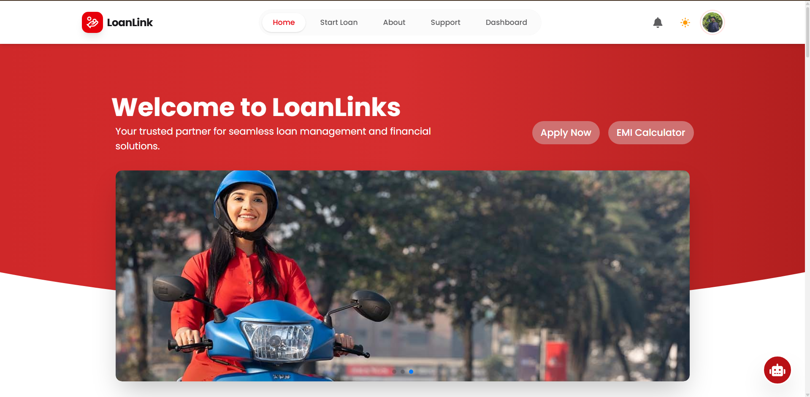
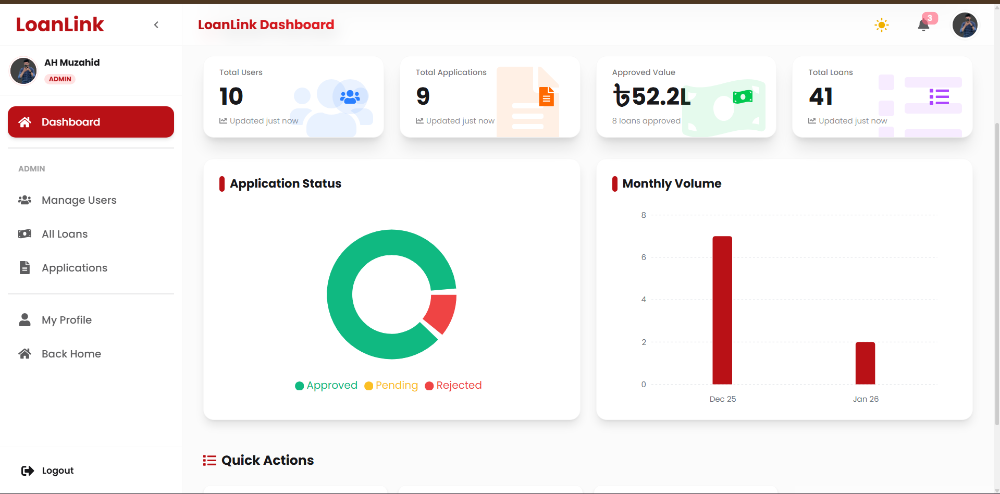
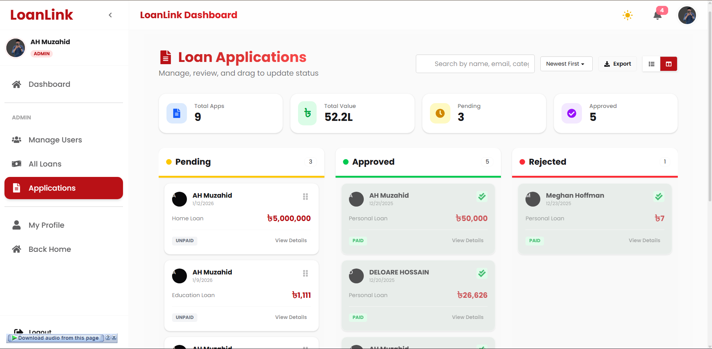
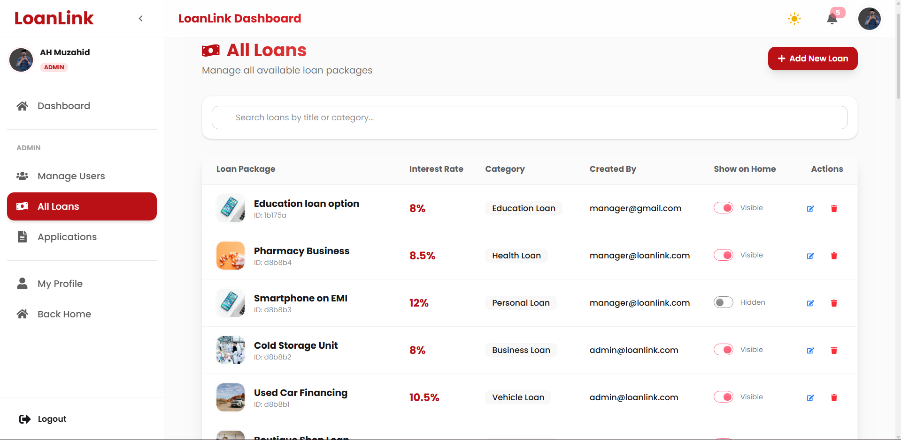

# 🏦 LoanLinks - Advanced Loan Management System



    

LoanLinks is a robust, full-stack web application designed to streamline the loan application and management process. It bridges the gap between borrowers and lending institutions, offering a seamless experience for applying, tracking, and managing loans. Built with modern web technologies, it features secure authentication, real-time data visualization, AI-powered assistance, and role-based dashboards.

## 📑 Table of Contents
- [Live Demo](#-live-demo)
- [Key Features](#-key-features)
- [Screenshots](#-application-screenshots)
- [Technology Stack](#-technology-stack)
- [Project Structure](#-project-structure)
- [Installation & Setup](#-%EF%B8%8F-installation--setup)
- [Contribution](#-contribution)
- [License](#-license)
- [Contact](#-contact)

## 🚀 Live Demo

**[Visit Live Site →](https://loan-link-two.vercel.app/)**

---

## 🌟 Key Features

### 🔐 Authentication & Security
- **Secure Login/Register:** Email/Password authentication powered by Firebase.
- **Social Login:** One-click Google Sign-In integration.
- **Role-Based Access Control (RBAC):** Distinct dashboards and permissions for **Borrowers**, **Managers**, and **Admins**.
- **Route Protection:** Secure private routes ensuring data privacy.

### 👤 User (Borrower) Features
- **Loan Application:** Easy-to-use multi-step forms for applying for various loan types.
- **Dashboard:** Personalized overview of active loans, payment schedules, and history.
- **EMI Calculator:** Built-in tool to estimate monthly payments before applying.
- **AI Chatbot:** Intelligent assistant (powered by Google Gemini/Groq) to answer financial queries.
- **Payment Integration:** Secure fee payment processing via Stripe.

### 🛠 Administrative Tools
- **Manager Dashboard:** Review applications, approve/reject loans, and manage borrower profiles.
- **Admin Control:** System-wide settings, user management, and comprehensive reporting.
- **Data Visualization:** Interactive charts and graphs (Recharts) for financial insights.
- **Data Export:** Seamlessly export user and loan data to **CSV** for offline analysis.
- **Document Generation:** Download official loan agreements, summaries, and reports in **PDF** format.

### 🎨 UI/UX Excellence
- **Responsive Design:** Fully optimized for Mobile, Tablet, and Desktop using Tailwind CSS.
- **Modern Components:** Polished UI elements from DaisyUI and Lucide React icons.
- **Smooth Animations:** Integrated Framer Motion & AOS for fluid transitions.
- **Interactive Elements:** Drag-and-drop functionality, toast notifications, and dynamic loaders.

---

## 📸 Application Screenshots

| Admin Dashboard Home | Loan Board (Drag & Drop) | Loan Management |
|:------------------:|:------------:|:------------:|
|  |  |  |

---

## 🏗️ Technology Stack

### **Frontend Core**
- **Framework:** [React 19](https://react.dev/)
- **Build Tool:** [Vite](https://vitejs.dev/)
- **State Management:** [Zustand](https://github.com/pmndrs/zustand)
- **Routing:** [React Router DOM](https://reactrouter.com/)

### **Styling & Design**
- **CSS Framework:** [Tailwind CSS v4](https://tailwindcss.com/)
- **Component Library:** [DaisyUI](https://daisyui.com/)
- **Icons:** [React Icons](https://react-icons.github.io/react-icons/) & [Lucide React](https://lucide.dev/)
- **Animations:** [Framer Motion](https://www.framer.com/motion/) & [AOS](https://michalsnik.github.io/aos/)

### **Functionality & APIs**
- **API Client:** [Axios](https://axios-http.com/)
- **Data Fetching:** [TanStack Query (React Query)](https://tanstack.com/query/latest)
- **Forms:** [React Hook Form](https://react-hook-form.com/)
- **Charts:** [Recharts](https://recharts.org/)
- **PDF Generation:** [jsPDF](https://github.com/parallax/jsPDF)

### **AI & Services**
- **Authentication:** [Firebase Auth](https://firebase.google.com/)
- **AI Integration:** Google Generative AI (Gemini) & Groq SDK
- **Payments:** Stripe

---

## � Project Structure

```bash
LoanLinks/
├── src/
│   ├── assets/          # Static assets (images, icons)
│   ├── Componets/       # Reusable UI components
│   │   ├── Chatbot/     # AI Chatbot implementation
│   │   ├── Dashboard/   # Dashboard specific widgets
│   │   ├── LoanCard/    # Loan display components
│   │   └── Shared/      # Buttons, Inputs, etc.
│   ├── Hooks/           # Custom React hooks (useAuth, useRole)
│   ├── Layouts/         # Main and Dashboard layouts
│   ├── pages/           # Application views (Home, Login, AllLoans)
│   ├── Providers/       # Context Providers (Auth, Theme)
│   ├── routes/          # Navigation and Route definitions
│   ├── utils/           # Helper functions
│   └── main.jsx         # Application entry point
├── public/              # Public static files
├── .env.local           # Environment variables
└── package.json         # Dependencies and scripts
```

---

## 🛠️ Installation & Setup

Follow these steps to set up the project locally.

### Prerequisites
- Node.js (v18 or higher)
- npm or yarn
- Firebase Project
- MongoDB (for backend)

### 1. Clone the Repository
```bash
git clone https://github.com/AH-Muzahid/LoanLink.git
cd LoanLink
```

### 2. Install Dependencies
Navigate to the client directory and install packages:
```bash
cd "LoanLinks clients"
npm install
```

### 3. Environment Configuration
Create a `.env.local` file in the root of the client directory and add your credentials:

```env
# Firebase Configuration
VITE_apiKey=your_api_key
VITE_authDomain=your_project.firebaseapp.com
VITE_projectId=your_project_id
VITE_storageBucket=your_project.appspot.com
VITE_messagingSenderId=your_sender_id
VITE_appId=your_app_id

# Backend API
VITE_API_URL=http://localhost:5000

# Stripe
VITE_PAYMENT_GATEWAY_PK=your_stripe_publishable_key
```

### 4. Run the Application
Start the development server:
```bash
npm run dev
```
The app will unlock at `http://localhost:5173`.

---

## 🤝 Contribution

Contributions are welcome! If you have suggestions or want to improve the project:

1.  **Fork** the repository.
2.  Create a new **Branch** (`git checkout -b feature/AmazingFeature`).
3.  **Commit** your changes (`git commit -m 'Add some AmazingFeature'`).
4.  **Push** to the branch (`git push origin feature/AmazingFeature`).
5.  Open a **Pull Request**.

---

## � License

This project is open-source and available under the information [MIT License](LICENSE).

---

### � Contact

**AH Muzahid**
- **GitHub:** [@AH-Muzahid](https://github.com/AH-Muzahid)
- **Email:** ahmuzahid40@gmail.com
